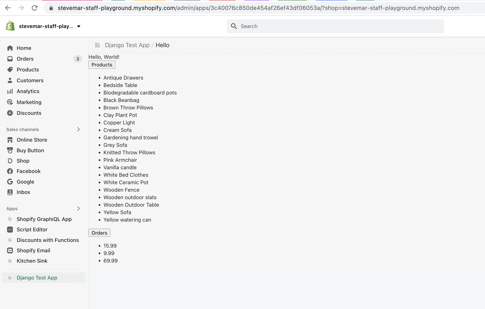

# Sample Django App

A demo app created using Django and ShopifyAPI `v8.4+`.

## Quick start

To run this app locally, you can clone the repository and do the following.

1. Create a `.env` file to specify this app's `API key` and `API secret key` app credentials that can be found in the Shopify Partners dashboard.

```ini
SHOPIFY_API_KEY=<The API key app credential specified in the Shopify Partners dashboard>
SHOPIFY_API_SECRET=<The API secret key app credential specified in the Shopify Partners dashboard>
APP_URL=<The public app URL specified in the Shopify Partners dashboard>
SCOPES=<Scopes needed for the app>
```

> __Note:__ If you do not have an API key or an API secret key, see the following sections of the [Build a Shopify App with Node and React](https://shopify.dev/tutorials/build-a-shopify-app-with-node-and-react/embed-your-app-in-shopify#get-a-shopify-api-key) guide.
>
> 1. [Expose your dev environment](https://shopify.dev/tutorials/build-a-shopify-app-with-node-and-react/embed-your-app-in-shopify#expose-your-dev-environment)
> 2. [Get a Shopify API Key and Shopify API secret key](https://shopify.dev/tutorials/build-a-shopify-app-with-node-and-react/embed-your-app-in-shopify#get-a-shopify-api-key)
> 3. [Add the Shopify API Key and Shopify API secret key](https://shopify.dev/tutorials/build-a-shopify-app-with-node-and-react/embed-your-app-in-shopify#add-the-shopify-api-key)

2. Run the following to install the required dependencies:

```console
$ pip install -r requirements.txt
```

3. Change directories to the main `sample_django_app` app and run all pending migrations:

```console
$ cd sample_django_app
$ python manage.py migrate
```

4. Ensure ngrok is running on port `8000`:

```console
$ ngrok http 8000
```

5. In a new terminal, run the server:

```console
$ python manage.py runserver
```

6. Create an `APP_URL` environment variable based on the URL ngrok gives you. This is used in the `CSRF_TRUSTED_ORIGINS` and `ALLOWED_HOSTS` section of `settings.py`. Do not include a schema (http:// or https://) in this variable.

```ini
export APP_URL=<ngrok-url.ngrok.io>
```

7. From the Partner dashboard, update the "App URL" and "Allowed redirection URL(s)" to include the callback URL:

```
<https://ngrok-url.ngrok.io>/auth/shopify/callback
```

8. In your browser, open the `https` ngrok url to install and open this app on a shop. Requests to authenticated resources like the `products` view in the `api` app should now be secured with an `Authorization: Bearer <session token>` header.


